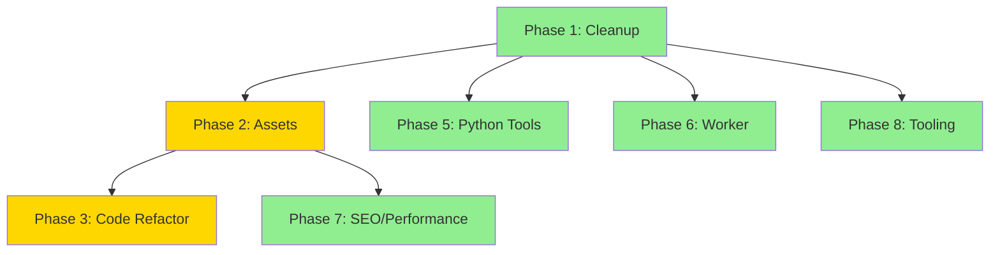

# 813 Wu Wei Repository Audit & Restructuring Plan

> **Implementation-Ready Roadmap for OpenCode**
>
> This document provides a step-by-step execution plan to clean, restructure, and optimize the Tampa Bay Biodiversity Atlas website repository.

---

## Executive Summary

The repository contains a static website for the Tampa Bay Biodiversity Atlas with interactive quiz games, a generative image tool, and supporting Python scrapers. The codebase has grown organically and now requires structural improvements to improve maintainability, reduce duplication, and optimize performance.

### Key Findings

| Category | Issue | Impact | Priority |
|----------|-------|--------|----------|
| **Structure** | Loose files at root level | High clutter, poor discoverability | 🔴 High |
| **Code** | Duplicate game logic (~300 lines) | Maintenance burden | 🔴 High |
| **Assets** | Inconsistent naming conventions | Broken references possible | 🟡 Medium |
| **Performance** | Large unoptimized images | Slow page loads | 🟡 Medium |
| **Tooling** | Missing linting/formatting config | Code quality drift | 🟢 Low |
| **Dev Artifacts** | Uncommitted local files not gitignored | Noise in repo | 🟢 Low |

---

## Phase 1: Cleanup & Gitignore Improvements

**Dependencies:** None  
**Risk:** Low  
**Estimated Effort:** Small

### Task 1.1: Update `.gitignore`

**Purpose:** Prevent development artifacts, OS files, and build outputs from being tracked.

```diff
# Current .gitignore
output/plates_prompts/
apikey.txt

# Add the following lines:
+# OS files
+.DS_Store
+Thumbs.db
+
+# Node
+node_modules/
+
+# Build outputs
+output/
+
+# IDE
+.idea/
+.vscode/
+*.swp
+
+# Python
+__pycache__/
+*.pyc
+.env
+
+# Local dev
+*.log
```

**File:** `.gitignore`  
**Action:** MODIFY

---

### Task 1.2: Delete Tracked `.DS_Store` Files

**Purpose:** Remove macOS metadata files that were previously committed.

**Commands:**
```bash
find . -name '.DS_Store' -type f -delete
git add -A
git commit -m "chore: remove .DS_Store files"
```

**Files to delete:**
- `.DS_Store` (root)
- `Photos/.DS_Store`
- `assets/.DS_Store`
- `audio/.DS_Store` (if exists)
- `florida_fish_scraper/.DS_Store`
- `games/.DS_Store`
- `output/.DS_Store`
- `worker/.DS_Store`
- `wip/.DS_Store` (if exists)

---

### Task 1.3: Clean Root-Level Clutter

**Purpose:** Move development/utility files out of the web-servable root.

| File | Current Location | Action | New Location |
|------|------------------|--------|--------------|
| `build_plate_prompts.py` | `/` (root) | MOVE | `tools/build_plate_prompts.py` |
| `generate_plate_images.py` | `/` (root) | MOVE | `tools/generate_plate_images.py` |
| `base image.png` | `/` (root) | MOVE | `tools/assets/base-image.png` |
| `style ref.png` | `/` (root) | MOVE | `tools/assets/style-ref.png` |
| `links.txt` | `/` (root) | MOVE | `docs/links.txt` |
| `ecological_communities.pdf` | `/` (root) | KEEP | Keep for download link |

**Directories to create:**
- `tools/` — Python scripts and generation tools
- `tools/assets/` — Reference images for generation
- `docs/` — Documentation and reference materials

**Verification:**  
Ensure no broken references in HTML. The PDF stays at root since it's linked from `index.html`.

---

## Phase 2: Asset Organization

**Dependencies:** Phase 1  
**Risk:** Medium (broken image references)  
**Estimated Effort:** Medium

### Task 2.1: Consolidate Media Assets

**Purpose:** Create a unified, predictable asset structure.

**Current Structure (Problematic):**
```
/bird/           # 49 bird images
/Photos/Biomes/  # Biome images
/audio/          # 47 audio files
/assets/         # SVG patterns only
```

**Target Structure:**
```
/assets/
├── images/
│   ├── birds/          # Moved from /bird/
│   └── biomes/         # Moved from /Photos/Biomes/
├── audio/              # Moved from /audio/
└── patterns/           # Moved from /assets/*.svg
```

**Migration Steps:**

1. Create new directory structure
2. Move files (preserving names)
3. Update all references in:
   - `games/bird-guess/game.js` — Update `IMAGE_BASE` and `AUDIO_BASE` constants
   - `games/biome-guess/game.js` — Update `IMAGE_BASE` constant
   - `styles/main.css` — Update pattern SVG path

**Code Changes:**

```javascript
// games/bird-guess/game.js
// OLD:
const IMAGE_BASE = "../../bird/";
const AUDIO_BASE = "../../audio/";

// NEW:
const IMAGE_BASE = "/assets/images/birds/";
const AUDIO_BASE = "/assets/audio/";
```

```javascript
// games/biome-guess/game.js
// OLD:
const IMAGE_BASE = "../../Photos/Biomes/";

// NEW:
const IMAGE_BASE = "/assets/images/biomes/";
```

```css
/* styles/main.css */
/* OLD: */
background-image: url("/assets/pattern-ecology.svg");

/* NEW: */
background-image: url("/assets/patterns/pattern-ecology.svg");
```

### Task 2.2: Fix Inconsistent File Naming

**Purpose:** Standardize on lowercase-kebab-case for all asset files.

**Issues Found:**
- Biome images use spaces and mixed case: `Xeric Hammock.png`, `Wet Prairie.png`
- Bird image has `.jpg` instead of `.webp`: `wilsons-snipe.jpg`

**Action:** Rename biome images to kebab-case:
```
Xeric Hammock.png       → xeric-hammock.png
Wet Prairie.png         → wet-prairie.png
Wet Flatwoods.png       → wet-flatwoods.png
... (all 48 biome images)
```

**Code Changes Required:** Update `BIOME_DETAILS` array in `games/biome-guess/game.js` with new filenames.

**Verification:**
1. Run local server: `npx serve .` or `python -m http.server`
2. Navigate to each game and verify images load
3. Check browser console for 404 errors

---

## Phase 3: Code Deduplication & Refactoring

**Dependencies:** Phase 2  
**Risk:** Medium  
**Estimated Effort:** Large

### Task 3.1: Extract Shared Game Framework

**Purpose:** The `bird-guess` and `biome-guess` games share ~70% identical logic.

**Duplicate Code Identified:**
- Shuffle function (identical)
- Feedback functions (identical)
- Button state management (similar)
- Round flow logic (similar)
- Keyboard handling (similar)
- Start/Next button handlers (similar)

**Action:** Create shared game library.

**New Files:**
```
games/shared/
├── game-core.js    # Shared game logic
└── game-styles.css # Shared game styles
```

**`games/shared/game-core.js` Structure:**
```javascript
// Shared utilities
export function shuffle(array) { ... }
export function pickDistractors(items, correctItem, count) { ... }

// Game state management
export class QuizGame {
  constructor(options) { ... }
  startRound() { ... }
  selectChoice(index) { ... }
  nextRound() { ... }
  // ...
}
```

**Refactored Game Files:**
- `bird-guess/game.js` — Import from shared, add bird-specific config
- `biome-guess/game.js` — Import from shared, add biome-specific config

> [!WARNING]
> This requires converting to ES modules. Games will need `type="module"` on script tags.

### Task 3.2: Consolidate Game CSS

**Purpose:** Games have separate CSS files with duplicated styles.

| File | Lines | Overlap |
|------|-------|---------|
| `games/bird-guess/game.css` | 98 | ~70% |
| `games/biome-guess/game.css` | 111 | ~70% |

**Action:** Merge shared styles into `games/shared/game-styles.css`, keep game-specific overrides in individual files.

### Task 3.3: Refactor img-gen Application

**Purpose:** The `img-gen/app.js` file is 1415 lines of monolithic JavaScript.

**Recommended Structure:**
```
img-gen/
├── index.html
├── styles.css
├── app.js              # Main entry, imports modules
├── modules/
│   ├── config.js       # Constants, token lists, stopwords
│   ├── canvas.js       # WebGL rendering logic
│   ├── clustering.js   # k-means and vector operations
│   ├── prompt.js       # Prompt building logic
│   └── api.js          # Worker communication
└── default.png
```

> [!NOTE]
> This is a significant refactor. Consider deferring to a later sprint if time-constrained.

---

## Phase 4: WIP Archival

**Dependencies:** None  
**Risk:** Low  
**Estimated Effort:** Small  
**Decision:** ✅ Archive for later (user confirmed)

### Task 4.1: Move `/wip/` to Archive

**Purpose:** Preserve work-in-progress while removing from active codebase.

**Action:** Move the WIP folder to an archive location.

**Steps:**
```bash
mkdir -p archive
mv wip archive/wip-homepage-redesign
git add -A
git commit -m "chore: archive WIP homepage redesign for later"
```

**Result:** The alternative homepage design is preserved in `archive/wip-homepage-redesign/` for future reference.

---

## Phase 5: Python Tools Reorganization

**Dependencies:** Phase 1  
**Risk:** Low  
**Estimated Effort:** Small

### Task 5.1: Consolidate Python Scripts

**Purpose:** Group development tools together.

**Current Scattered Files:**
- `/build_plate_prompts.py`
- `/generate_plate_images.py`
- `/florida_fish_scraper/scrape_florida_fish.py`
- `/florida_fish_scraper/rename_images_to_fish_names.py`

**Target Structure:**
```
tools/
├── plates/
│   ├── build_prompts.py
│   ├── generate_images.py
│   └── assets/
│       ├── base-image.png
│       └── style-ref.png
└── scrapers/
    └── florida_fish/
        ├── scrape.py
        ├── rename_images.py
        └── output/          # 463 scraped images
```

### Task 5.2: Add Python Requirements

**Purpose:** Document Python dependencies.

**New File:** `tools/requirements.txt`
```
# Add dependencies found in Python files
requests
beautifulsoup4
openai
Pillow
```

---

## Phase 6: Worker Backend Cleanup

**Dependencies:** None  
**Risk:** Low  
**Estimated Effort:** Small

### Task 6.1: Clean Worker Directory

**Purpose:** Remove unnecessary files from Cloudflare Worker.

**Current Files:**
```
worker/
├── node_modules/     # Should be gitignored
├── package-lock.json
├── package.json
├── src/index.js
└── wrangler.jsonc
```

**Action:**
1. Add `worker/node_modules/` to `.gitignore`
2. Remove `worker/node_modules/` from git tracking if committed
3. Update README with local development instructions

---

## Phase 7: SEO & Performance

**Dependencies:** Phases 1-2  
**Risk:** Low  
**Estimated Effort:** Medium

### Task 7.1: Add Meta Tags

**Purpose:** Improve search engine visibility.

**Files to Modify:**
- `index.html`
- `biomes/index.html`
- `games/bird-guess/index.html`
- `games/biome-guess/index.html`
- `img-gen/index.html`

**Changes per file:**
```html
<head>
  <!-- Add: -->
  <meta name="description" content="Explore Tampa Bay's ecological communities, birds, and habitats through interactive guides and games.">
  <meta property="og:title" content="Tampa Bay Biodiversity Atlas">
  <meta property="og:description" content="...">
  <meta property="og:type" content="website">
  <link rel="canonical" href="https://813wuwei.com/">
</head>
```

### Task 7.2: Convert Wilson's Snipe Image

**Purpose:** Single inconsistent image format.

**File:** `bird/wilsons-snipe.jpg` (85KB)  
**Action:** Convert to WebP format for consistency and smaller size.

**Command:**
```bash
cwebp wilsons-snipe.jpg -o wilsons-snipe.webp
```

**Update Reference:** `games/bird-guess/game.js` line 39

---

## Phase 8: Add Development Tooling

**Dependencies:** None  
**Risk:** Low  
**Estimated Effort:** Medium

### Task 8.1: Add Prettier Configuration

**Purpose:** Enforce consistent code formatting.

**New File:** `.prettierrc`
```json
{
  "semi": true,
  "singleQuote": false,
  "tabWidth": 2,
  "printWidth": 100,
  "trailingComma": "none"
}
```

### Task 8.2: Add EditorConfig

**Purpose:** Ensure consistent editor settings.

**New File:** `.editorconfig`
```ini
root = true

[*]
indent_style = space
indent_size = 2
end_of_line = lf
charset = utf-8
trim_trailing_whitespace = true
insert_final_newline = true

[*.md]
trim_trailing_whitespace = false
```

### Task 8.3: Add Package.json Scripts

**Purpose:** Standardize common commands.

**New File (root):** `package.json`
```json
{
  "name": "813wuwei",
  "version": "1.0.0",
  "private": true,
  "scripts": {
    "dev": "npx serve .",
    "format": "prettier --write '**/*.{js,css,html,json,md}'",
    "lint:links": "npx linkinator . --recurse --skip 'node_modules'"
  },
  "devDependencies": {
    "prettier": "^3.0.0"
  }
}
```

---

## Verification Plan

### Automated Checks

| Check | Command | What It Validates |
|-------|---------|-------------------|
| **Broken Links** | `npx linkinator . --recurse --skip 'node_modules'` | All internal links work |
| **HTML Validity** | `npx html-validate index.html` | HTML is valid |
| **404 Errors** | Browser DevTools Network tab | No missing assets |

### Manual Verification

#### UI Regression Checklist

| Page | Check | Pass? |
|------|-------|-------|
| Homepage | Hero section displays correctly | ☐ |
| Homepage | Background pattern loads | ☐ |
| Homepage | Navigation links work | ☐ |
| Bird Game | Start button works | ☐ |
| Bird Game | Images load correctly | ☐ |
| Bird Game | Audio plays | ☐ |
| Bird Game | Next round works | ☐ |
| Biome Game | Start button works | ☐ |
| Biome Game | Images load correctly | ☐ |
| Biome Game | Info panel shows after guess | ☐ |
| Img-Gen | Canvas renders | ☐ |
| Img-Gen | Generate button works | ☐ |

#### Responsiveness Checklist

| Breakpoint | Pages to Check |
|------------|----------------|
| Mobile (375px) | All pages |
| Tablet (768px) | All pages |
| Desktop (1024px+) | All pages |

#### Performance Check

1. Run: `npx lighthouse https://localhost:8080 --view`
2. Target scores: Performance > 90, Accessibility > 90

---

## Recommended Execution Order



| Phase | Priority | Can Parallelize With |
|-------|----------|---------------------|
| 1. Cleanup | 🔴 High | - |
| 2. Assets | 🔴 High | 5, 6, 8 |
| 3. Code Refactor | 🟡 Medium | - |
| 4. WIP Decision | ⚪ User | Any |
| 5. Python Tools | 🟢 Low | 2, 6, 8 |
| 6. Worker | 🟢 Low | 2, 5, 8 |
| 7. SEO/Perf | 🟢 Low | After 2 |
| 8. Tooling | 🟢 Low | 2, 5, 6 |

---

## Summary

This plan addresses the main structural, organizational, and code quality issues in the repository. The phases are designed to be executed incrementally with verification at each step.

**Quick Wins (Do First):**
1. Update `.gitignore` and remove `.DS_Store` files
2. Move Python scripts to `tools/` directory
3. Add development tooling (Prettier, EditorConfig)

**High-Impact Changes:**
1. Consolidate assets into unified structure
2. Extract shared game framework
3. Add SEO meta tags

**Deferred/Optional:**
1. img-gen modularization (complex, consider later)
2. WIP integration (requires design decision)
