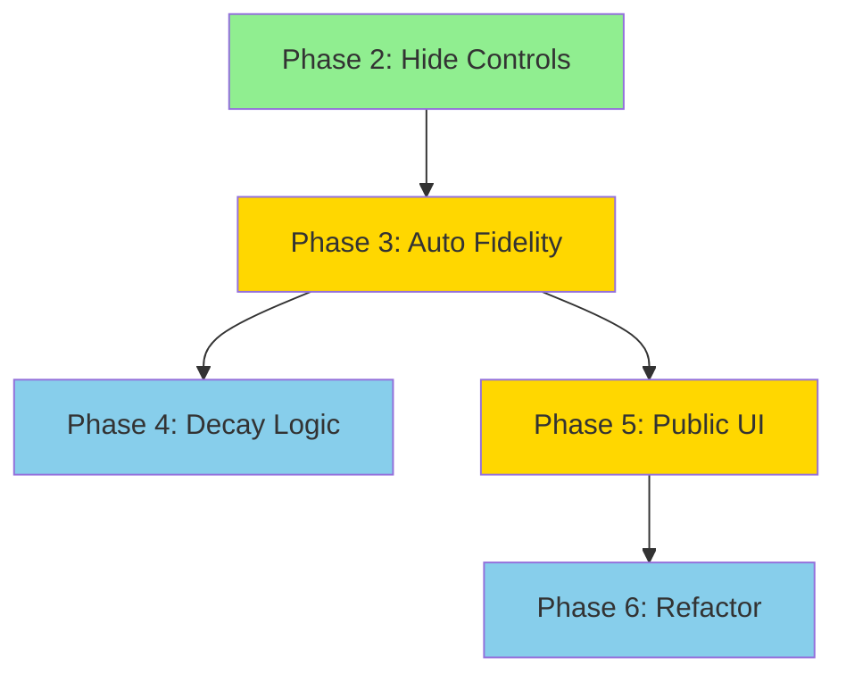

# Permanent Impermanence: System Audit & Execution Plan

> **OpenCode Roadmap** for implementing the interactive artwork that visualizes permanent impermanence.

---

## Executive Summary

The intended system is a static GitHub Pages site where a public main page collects text inputs, and a hidden `/img-gen/` page renders a WebGL canvas that coheres/collapses based on input rate. The current implementation has the **core rendering infrastructure in place** but diverges from the intended design in several key areas.

### What Works ✅
- WebGL pixel UV-remapping shader (not opacity/blur)
- At minimum coherence → TV static; at maximum → clear image
- Prompt generation enforces abstract, non-literal constraints
- Dev panel hidden behind `?dev=1`
- Backend worker with rate tracking and image generation
- `/img-gen/` not linked from main navigation

### What's Broken/Missing ❌
| Issue | Impact | Priority |
|-------|--------|----------|
| Main page has no text input/Send button | Users cannot interact at all | 🔴 Critical |
| Fidelity slider exposed to users | Users can directly control coherence (violates spec) | 🔴 Critical |
| Rate→coherence not driving visual automatically | Fidelity must come from backend rate, not UI | 🔴 Critical |
| No sensitivity slider effect visible | Slider exists but doesn't influence rate→coherence mapping | 🟡 Medium |
| img-gen page shows Generate button to non-dev users | Manual generation should be dev-only | 🟡 Medium |
| Main page is biodiversity atlas, not artwork | Needs redesign or new dedicated page | 🔴 Critical |

---

## Audit Details

### 1. Main Page (`/index.html`)

**Current State**: The main page is the "Tampa Bay Biodiversity Atlas" with ecological content. There is **no text input field** and **no Send button**.

**Intended State**: A public page with:
- Text input field
- "Send" button
- Sensitivity slider (adjusts how strongly rate affects coherence)

**Divergence**: Complete mismatch—current page serves a different purpose entirely.

---

### 2. Image Generation Page (`/img-gen/`)

**Current State**: 
- WebGL canvas with UV-remapping shader ✅
- "Words" textarea + "Send" button ✅
- Coherence Sensitivity slider ✅
- **Fidelity slider exposed** ❌ (lines 36-38 of `index.html`)
- "Generate" button visible to all users ❌ (line 39)
- Dev panel correctly hidden behind `?dev=1` ✅

**Code Analysis** (from [app.js](file:///Users/kailashpermaul/Documents/GitHub/813wuwei/img-gen/app.js)):

```javascript
// Line 389: Dev mode correctly gated
const devEnabled = new URLSearchParams(window.location.search).get("dev") === "1";

// Lines 842-929: Fragment shader implements UV remapping
// At fidelity < 0.02 → pure noise (TV static)
// As fidelity increases → coherent image via zone-based sampling
```

**Issues**:
1. **Fidelity slider** (lines 36-38) allows direct user control—violates spec
2. **Generate button** (line 39) should only appear in dev mode
3. **Sensitivity slider** exists but doesn't influence the rate→coherence calculation

---

### 3. Backend Worker (`/worker/src/index.js`)

**Current State**:
- Durable Object stores global state including `fidelity`, `prompt`, `image_key`
- `/v1/prompt/add` endpoint:
  - Records timestamp in 30-second sliding window
  - Calculates fidelity as `(timestamps_in_window / 100) * 100`
  - Aggregates words into prompt sessions
- Rate-to-fidelity logic exists ✅

**Code Analysis**:
```javascript
// Lines 576-582: Rate tracking
const TARGET = 100;
state.fidelity = clamp(
  Math.ceil((prunedLen / TARGET) * 100),
  0,
  100
);
```

**Issues**:
1. **Sensitivity not applied**: The frontend sensitivity slider value is never sent to the backend
2. **No decay/collapse**: Backend calculates fidelity only when new words arrive; no background decay toward noise
3. **Polling fidelity from backend**: Client polls `/v1/state` but doesn't automatically apply fidelity to shader

---

### 4. Coherence Logic

**Intended Behavior**:
- High input rate → high coherence (unstable)
- Medium input rate → lower fidelity but stable
- Low input rate → collapse into noise
- Sensitivity slider adjusts the rate→coherence curve

**Current Behavior**:
- Backend computes raw rate→fidelity
- Frontend can override via fidelity slider
- Sensitivity slider has no effect on actual coherence
- Fidelity only updates when user sends words (no passive decay)

---

### 5. Prompt Generation

**Current State**: ✅ Correctly implemented

The prompt system:
- Maps words to affect, motion, material, light, color, place categories
- Builds abstract, non-figurative prompts
- Enforces `STYLE_SPINE` constraints (no people, objects, text, etc.)
- Uses `NEGATIVE_PROMPT` for disallowed elements

---

## Execution Plan

### Phase 1: Main Page Transformation

**Goal**: Create the public-facing input interface.

#### Task 1.1: Create New Artwork Page or Modify Root

> [!IMPORTANT]
> Decide whether to:
> A) Create a dedicated `/artwork/` page for the interactive system
> B) Repurpose the root `/index.html` and move biodiversity atlas elsewhere
> 
> Recommend option A to preserve existing site.

**Files to Create/Modify**:
- `[NEW] /artwork/index.html` — Public input page
- `[NEW] /artwork/styles.css` — Minimal styling

**Contents of `/artwork/index.html`**:
```
- Full-bleed canvas background (WebGL from img-gen)
- Semi-transparent overlay with:
  - Text input (textarea or single input)
  - "Send" button
  - Sensitivity slider labeled "Responsiveness" or similar
- No fidelity control
- No Generate button
- Link/redirect to hidden /img-gen/?dev=1 for developers only
```

**Validation**:
- [ ] Page loads with canvas visible
- [ ] Send button submits to `/v1/prompt/add`
- [ ] Fidelity slider is NOT present
- [ ] Sensitivity slider is visible and adjustable

---

### Phase 2: Hide User-Facing Controls

**Goal**: Remove direct coherence control from non-developers.

#### Task 2.1: Conditionally Hide Fidelity Slider

**File**: [img-gen/index.html](file:///Users/kailashpermaul/Documents/GitHub/813wuwei/img-gen/index.html)

**Change**:
```html
<!-- Wrap fidelity slider in dev-only container -->
<div class="dev-only" style="display: none;">
  <label class="control">
    <span>Fidelity</span>
    <input id="fidelitySlider" type="range" ... />
  </label>
</div>
```

**File**: [img-gen/app.js](file:///Users/kailashpermaul/Documents/GitHub/813wuwei/img-gen/app.js)

**Change** (add after line 393):
```javascript
// Show dev-only elements when dev mode is enabled
if (devEnabled) {
  document.querySelectorAll('.dev-only').forEach(el => {
    el.style.display = '';
  });
}
```

**Validation**:
- [ ] Without `?dev=1`: Fidelity slider hidden
- [ ] With `?dev=1`: Fidelity slider visible

---

#### Task 2.2: Conditionally Hide Generate Button

**File**: [img-gen/index.html](file:///Users/kailashpermaul/Documents/GitHub/813wuwei/img-gen/index.html)

**Change**: Move Generate button into dev-only section or add class.

**Validation**:
- [ ] Without `?dev=1`: Generate button hidden
- [ ] With `?dev=1`: Generate button visible

---

### Phase 3: Automatic Fidelity Sync

**Goal**: Fidelity driven automatically by backend rate, not user slider.

#### Task 3.1: Apply Backend Fidelity to Shader

**File**: [img-gen/app.js](file:///Users/kailashpermaul/Documents/GitHub/813wuwei/img-gen/app.js)

**Current Issue**: Backend returns `fidelity` in `/v1/state`, but it's applied to slider, not directly to shader.

**Change**: When not in dev mode, ignore slider input and only use backend fidelity:

```javascript
// In syncSharedState() callback (around line 1170):
if (!devEnabled && Number.isFinite(state?.fidelity)) {
  // Directly set shader fidelity, bypassing slider
  fidelity = state.fidelity / 100; // normalize 0-100 to 0-1
  targetFidelity = fidelity;
}
```

**Validation**:
- [ ] Without `?dev=1`: Canvas coherence matches backend rate
- [ ] Slider doesn't affect visual output for non-dev users

---

#### Task 3.2: Implement Sensitivity Multiplier

**File**: [img-gen/app.js](file:///Users/kailashpermaul/Documents/GitHub/813wuwei/img-gen/app.js)

**Change**: Apply sensitivity slider to the rate→fidelity mapping:

```javascript
// In the fidelity application logic:
const sensitivity = Number(sensitivityInput.value); // 0-1
const baseFidelity = backendFidelity / 100;
const adjustedFidelity = Math.pow(baseFidelity, 1 + (1 - sensitivity));
fidelity = clamp(adjustedFidelity, 0, 1);
```

**Logic**:
- High sensitivity (1.0): Small rate changes cause big coherence swings
- Low sensitivity (0.0): Smooth, gradual coherence changes
- Uses exponential curve for natural feel

**Validation**:
- [ ] Sensitivity at 1.0: Rapid coherence changes with input bursts
- [ ] Sensitivity at 0.0: Slow, gradual coherence changes

---

### Phase 4: Passive Fidelity Decay (Optional Enhancement)

**Goal**: Coherence collapses over time without input.

#### Task 4.1: Backend Decay Logic

**File**: [worker/src/index.js](file:///Users/kailashpermaul/Documents/GitHub/813wuwei/worker/src/index.js)

**Change**: In `/v1/state` GET handler, recalculate fidelity based on current time:

```javascript
// In GET /v1/state handler:
const timestamps = await loadSendTimestamps(this.storage);
const now = Date.now();
const activeTimestamps = timestamps.filter(t => t >= now - 30000);
const TARGET = 100;
const calculatedFidelity = clamp(
  Math.ceil((activeTimestamps.length / TARGET) * 100),
  0,
  100
);
storedState.fidelity = calculatedFidelity;
```

**Validation**:
- [ ] No input for 30+ seconds → fidelity drops toward 0
- [ ] Canvas collapses to noise when fidelity is low

---

### Phase 5: Simple UI for Public Page

**Goal**: Clean, minimal public interface.

#### Task 5.1: Design Public Input UI

**File**: `[NEW] /artwork/index.html`

**Structure**:
```html
<!DOCTYPE html>
<html lang="en">
<head>
  <meta charset="UTF-8" />
  <meta name="viewport" content="width=device-width, initial-scale=1.0" />
  <title>Permanent Impermanence</title>
  <link rel="stylesheet" href="styles.css" />
</head>
<body>
  <canvas id="field"></canvas>
  <div class="input-overlay">
    <textarea id="userWords" placeholder="Enter words…" rows="2"></textarea>
    <button id="sendWordsBtn" type="button">Send</button>
    <label class="sensitivity-control">
      <span>Sensitivity</span>
      <input id="sensitivity" type="range" min="0" max="1" step="0.01" value="0.5" />
    </label>
  </div>
  <script src="app.js"></script>
</body>
</html>
```

**Styling**: Full-bleed canvas, floating input overlay at bottom, minimal aesthetic.

**Validation**:
- [ ] Canvas fills viewport
- [ ] Input overlay is visible and usable
- [ ] Matches intended aesthetic

---

### Phase 6: Refactor Shared Code

**Goal**: Avoid duplication between `/artwork/` and `/img-gen/`.

#### Task 6.1: Extract Shared Modules

**Files**:
- `[NEW] /shared/renderer.js` — WebGL shader and canvas logic
- `[NEW] /shared/api.js` — Backend communication
- `[NEW] /shared/prompt.js` — Prompt building utilities

**Approach**:
- `/artwork/app.js` imports shared modules, provides minimal UI
- `/img-gen/app.js` imports shared modules, provides full dev UI

**Validation**:
- [ ] Both pages render correctly
- [ ] No duplicate shader code

---

## Verification Plan

### Automated Checks
None available—this is a static site with no test framework.

### Manual Verification

| Test | Steps | Expected Result |
|------|-------|-----------------|
| **Canvas renders** | Load `/artwork/` or `/img-gen/` | WebGL canvas displays default image |
| **Noise at low fidelity** | Set fidelity to 0 (dev mode) | Canvas shows TV static |
| **Coherence at high fidelity** | Set fidelity to 100 (dev mode) | Canvas shows clear image |
| **Rate-driven coherence** | Send 50+ words quickly in non-dev mode | Canvas becomes more coherent |
| **Decay to noise** | Stop sending for 30+ seconds | Canvas collapses toward noise |
| **Sensitivity effect** | Adjust slider and send words | High sensitivity = rapid changes |
| **Dev controls hidden** | Load without `?dev=1` | Fidelity slider, Generate button hidden |
| **Dev controls visible** | Load with `?dev=1` | All dev tools accessible |
| **Prompt generation** | Send mood words | Prompt shows abstract, non-literal output |

### Browser Testing
```bash
# Local development
npx serve . -l 3000

# Test pages:
# http://localhost:3000/artwork/
# http://localhost:3000/img-gen/
# http://localhost:3000/img-gen/?dev=1
```

---

## Recommended Execution Order



| Phase | Priority | Dependencies |
|-------|----------|--------------|
| 2. Hide Controls | 🔴 High | None |
| 3. Auto Fidelity Sync | 🔴 High | Phase 2 |
| 4. Passive Decay | 🟡 Medium | Phase 3 |
| 5. Public UI | 🔴 High | Phase 3 |
| 6. Refactor | 🟢 Low | Phases 4-5 |

---

## Summary

The core visual system (WebGL UV remapping) works correctly. The main gaps are:

1. **No public input page** — Need to create `/artwork/` page
2. **Direct fidelity control exposed** — Hide behind `?dev=1`
3. **Rate→coherence not fully wired** — Apply backend fidelity directly to shader
4. **Sensitivity slider unused** — Integrate into rate→fidelity curve

Phases 2-3 fix the core issues. Phases 4-6 complete the experience.
